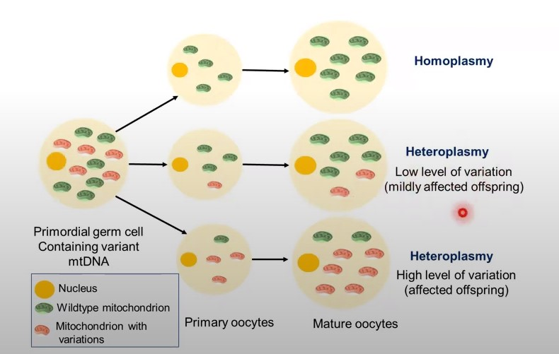

exception to pedigree analysis
1. dominant trait can skip generations
    1. de novo variations
    2. less than 100 percent penetrance ie disease didnt happen at all
2. mitochondrial disorders
    1. affected mothers may not transmit the traits to all children in case of variable expressivity i.e. varieties of clinical phenotype ie grading of the same diseasses, variable expressivity occurs due to heteroplasmy see 